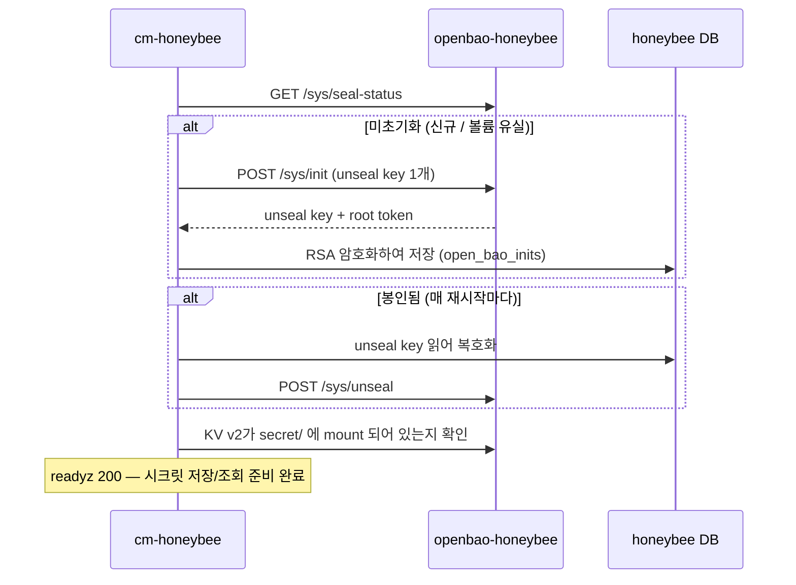

# cm-honeybee OpenBao (자립형 시크릿 백엔드)

cm-honeybee는 SSH 접속 시크릿과 CSP credential을 SQLite DB가 아닌 자체 **전용
OpenBao**(KV v2)에 저장합니다. 그리고 그 OpenBao를 **cm-honeybee가 스스로
관리**합니다 — `operator init` 실행, unseal, KV 엔진 활성화를 직접 수행하고,
OpenBao가 사용 가능해질 때까지 not-ready 상태로 대기합니다. **init 사이드카도
수동 unseal도 없어서**, 호스트 재부팅이나 볼륨 유실 후에도 스스로 복구합니다.

## 구조

컨테이너 2개 ([`../server/docker-compose.yaml`](../server/docker-compose.yaml) 참고):

| 서비스 | 역할 |
|--------|------|
| `openbao-honeybee` | OpenBao 서버 — 영속 파일 스토리지, KV v2, 포트 8200. cm-honeybee 전용(공용 스택 OpenBao와 별개). |
| `cm-honeybee` | honeybee 서버(8081/8082). OpenBao의 init/unseal/KV-enable을 HTTP API로 직접 수행하고 시크릿을 저장. |

서비스명이 `openbao`로 시작하는 것은 의도적입니다: cm-mayfly가 그 프리픽스로
OpenBao 서비스를 분류·보존합니다(secrets 카테고리, `remove --clean-db` 시 데이터
유지). Docker가 각 컨테이너를 독립적으로 감독하며(`restart: unless-stopped`),
OpenBao 서버는 honeybee 이미지에 번들되지 않습니다.

## 부팅 흐름

기동 시 cm-honeybee(`openbao.WaitReady`)가 OpenBao를 사용 가능 상태로 만들며,
아래 모든 단계가 성공할 때까지 `readyz`를 503으로 막습니다. Docker의 restart
policy는 compose `depends_on`을 무시하므로, 이 방식이 호스트 재부팅 시 컨테이너
기동 순서를 무의미하게 만듭니다.



## init / seal / unseal (개념)

- **init** (평생 1회): OpenBao가 모든 데이터를 암호화하는 **master key**를
  생성하고, 이를 unseal key share로 분할(무인 기동을 위해 1 share / threshold 1
  사용)하며 **root token**을 발급합니다. init 이후 vault는 *initialized* 이지만
  *sealed* 상태입니다.
- **sealed**: OpenBao는 master key를 절대 디스크에 저장하지 않고 unseal된 동안만
  RAM에 유지합니다. 그래서 **재시작하면 항상 sealed 상태로** 올라오며, unseal
  전까지 모든 시크릿 작업을 거부합니다.
- **unseal**: unseal key를 다시 넣어 master key를 RAM에 복원합니다. 재시작마다
  필요하며, cm-honeybee가 저장된 키로 자동 수행합니다.

## 열쇠 저장 위치 (DB, RSA 암호화)

unseal key + root token은 **평문 파일로 두지 않습니다.** cm-honeybee가 자체 DB에
honeybee 키로 RSA 암호화하여 저장합니다:

- 테이블 `open_bao_inits` (단일 행): `unseal_key_enc`, `root_token_enc`.
- `honeybee.pub`로 암호화하고 `honeybee.key`(`/root/.cm-honeybee/`)로 복호화 —
  honeybee가 다른 at-rest 시크릿에 쓰는 것과 동일한 키입니다. 이 RSA 키는 기동 시
  OpenBao보다 먼저 로드됩니다.

이렇게 하면 unseal 자료가 평문으로 디스크에 남지 않으므로, DB만 유출(예: 백업)
되어도 노출되지 않습니다. 다만 **defense-in-depth**이지 완전한 해결은 아닙니다:
`honeybee.key`도 같은 데이터 디렉토리에 있으므로, 데이터 디렉토리/디스크가 통째로
유출되면 복호화될 수 있습니다 — 그 경우까지 막는 완전한 답은 KMS auto-unseal
(아래)입니다.

## 복구 동작

| 상황 | cm-honeybee 동작 |
|------|------------------|
| 호스트 재부팅 / 컨테이너 재시작 (데이터 유지) | DB에서 저장된 키를 읽어 unseal — 재init 없음. |
| OpenBao **스토리지 볼륨** 유실 | OpenBao가 미초기화로 올라옴 → cm-honeybee가 재init(새 키, DB 행 덮어씀). **기존 시크릿은 소실**(빈 vault). |
| honeybee **DB 또는 `honeybee.key`** 유실, OpenBao 스토리지는 유지 | unseal key를 얻거나 복호화하지 못함 → unseal 불가 → not-ready 유지. 복구하려면 `honeybee.key`(및 DB)를 백업해 두어야 함. |

## 시크릿 경로 (KV v2, mount `secret/`)

| 종류 | 경로 |
|------|------|
| SSH 접속 시크릿 (password / private key) | `secret/honeybee/ssh/{connectionId}` |
| CSP credential | `secret/honeybee/csp/{sourceGroupId}` |

## 설정

주소만 지정하면 나머지는 cm-honeybee가 처리합니다:

- `cm-honeybee.openbao.address` (또는 환경변수 `HONEYBEE_VAULT_ADDR`),
  예: `http://openbao-honeybee:8200`. 비어 있으면 OpenBao 비활성화(시크릿이 필요한
  작업은 `OpenBao is required` 오류로 실패).

토큰·토큰 파일·unseal key·init 사이드카 등 설정할 것이 없습니다.

## 실행 & 검증

```bash
cd server
docker compose up -d
curl -s -o /dev/null -w '%{http_code}\n' http://localhost:8081/honeybee/readyz   # OpenBao 준비되면 200

# OpenBao 상태 (BAO_ADDR은 컨테이너 안에 미리 설정됨)
docker exec openbao-honeybee bao status                # Initialized true / Sealed false
docker logs cm-honeybee 2>&1 | grep OpenBao            # init / unseal / ready 로그
docker exec openbao-honeybee bao secrets list          # secret/ (kv v2)
```
