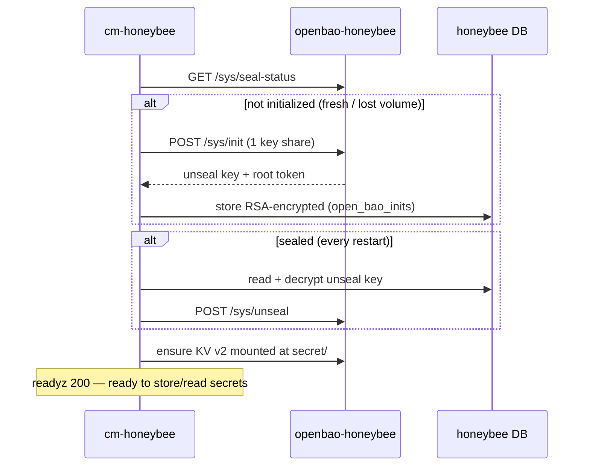

# cm-honeybee OpenBao (self-managed secrets backend)

cm-honeybee stores its SSH access secrets and CSP credentials in its own
**dedicated OpenBao** (KV v2) instead of the SQLite DB. cm-honeybee **manages
that OpenBao itself** — it runs `operator init`, unseals it, and enables the KV
engine on its own, and stays not-ready until OpenBao is usable. There is **no
init sidecar and no manual unseal**, so the stack recovers by itself after host
reboots and volume loss.

## Architecture

Two containers (see [`../docker-compose.yaml`](../docker-compose.yaml)):

| Service            | Role |
|--------------------|------|
| `openbao-honeybee` | OpenBao server — persistent file storage, KV v2, port 8200. Dedicated to cm-honeybee (not the shared stack OpenBao). |
| `cm-honeybee`      | honeybee server (8081/8082). Drives OpenBao's init/unseal/KV-enable over its HTTP API and stores secrets in it. |

The service name starts with `openbao` on purpose: cm-mayfly classifies and
preserves OpenBao services by that prefix (secrets category, `remove --clean-db`
keep). Docker supervises each container independently
(`restart: unless-stopped`); the OpenBao server is not bundled into the honeybee
image.

## Boot flow

On startup cm-honeybee (`openbao.WaitReady`) drives OpenBao to a usable state,
blocking `readyz` (503) until every step below succeeds. Because Docker restart
policies ignore compose `depends_on`, this is what makes container start order on
a host reboot irrelevant.



## init / seal / unseal (concepts)

- **init** (once, ever): OpenBao generates a **master key** that encrypts all
  data at rest, splits it into unseal key share(s) (we use 1 share / threshold 1
  for unattended startup), and issues a **root token**. After init the vault is
  *initialized* but *sealed*.
- **sealed**: OpenBao never persists the master key — it lives only in RAM while
  unsealed. So OpenBao comes up **sealed after every restart** and refuses all
  secret operations until unsealed.
- **unseal**: feed the unseal key back so OpenBao reconstructs the master key in
  RAM. Required after every restart; cm-honeybee does it automatically from its
  stored key.

## Where the keys live (DB, RSA-encrypted)

The unseal key + root token are **not** kept in a plaintext file. cm-honeybee
stores them in its own DB, RSA-encrypted with honeybee's key:

- Table `open_bao_inits` (single row): `unseal_key_enc`, `root_token_enc`.
- Encrypted with `honeybee.pub`, decrypted with `honeybee.key`
  (`/root/.cm-honeybee/`) — the same key honeybee uses for its other at-rest
  secrets. The RSA keys are loaded before OpenBao at startup.

This keeps the unseal material off disk in plaintext; a leak of the DB alone
(e.g. a backup) does not expose it. It is **defense-in-depth**, not a complete
fix: `honeybee.key` is also on disk in the same data dir, so a full
data-dir/disk compromise can still decrypt it — the complete answer for that is
KMS auto-unseal (below).

## Recovery behavior

| Situation | What cm-honeybee does |
|-----------|-----------------------|
| Host reboot / container restart (data intact) | Reads the stored key from the DB, unseals — no re-init. |
| OpenBao **storage volume** lost | OpenBao comes up uninitialized → cm-honeybee re-inits (new key, overwrites the DB row). **Existing secrets are lost** (fresh vault). |
| honeybee **DB or `honeybee.key`** lost, OpenBao storage intact | Cannot obtain/decrypt the unseal key → cannot unseal → stays not-ready. Back up `honeybee.key` (and the DB) to recover. |

## Secret paths (KV v2, mount `secret/`)

| Kind | Path |
|------|------|
| SSH access secret (password / private key) | `secret/honeybee/ssh/{connectionId}` |
| CSP credential | `secret/honeybee/csp/{sourceGroupId}` |

## Configuration

Only the address is needed — cm-honeybee handles the rest:

- `cm-honeybee.openbao.address` (or env `HONEYBEE_VAULT_ADDR`), e.g.
  `http://openbao-honeybee:8200`. Empty disables OpenBao (secret operations then
  fail with `OpenBao is required`).

No token, token file, unseal key, or init sidecar to configure.

## Run & verify

```bash
cd server
docker compose up -d
curl -s -o /dev/null -w '%{http_code}\n' http://localhost:8081/honeybee/readyz   # 200 when OpenBao is ready

# OpenBao state (BAO_ADDR is preset inside the container)
docker exec openbao-honeybee bao status                # Initialized true / Sealed false
docker logs cm-honeybee 2>&1 | grep OpenBao            # init / unseal / ready trail
docker exec openbao-honeybee bao secrets list          # secret/ (kv v2)
```

## Production hardening

The single-share auto-unseal above trades OpenBao's Shamir key-splitting for
unattended startup. For production:

1. **Cloud KMS auto-unseal** (recommended) — add a `seal "awskms" { … }` stanza
   to [`openbao-config.hcl`](openbao-config.hcl); OpenBao then auto-unseals from
   the KMS and no unseal key is stored locally at all.
2. Enable TLS (`tls_disable = false` + certs) on the listener.
3. Protect the honeybee data dir (`honeybee.key`, the DB) and back it up.

Runtime data (`data/`) is gitignored.
